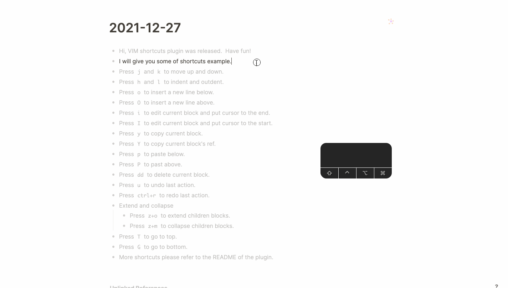

# logseq-plugin-vim-shortcuts

This plugin provide some shortcuts which give Logseq a feeling of VIM-like.

## Supported shortcuts

- `j`: Move to next line, in visual block mode it is for selecting down.
- `k`: Move to previous line in visual block mode it is for selecting up.
- `h`: Outdent.
- `l`: Indent.
- `J`: Move to next sibling, in visual block mode it is for moving down.
- `K`: Move to previous sibling, in visual block node it is for moving up.
- `H`: Highlight focus out to parent level.
- `L`: Highlight focus into child level.
- `i`: Enter edit mode, put the cursor to the end, and also `a` can do the same thing.
- `I`: Enter edit mode, put the cursor to the start.
- `yy`: Copy current block content. Only support one block, multi blocks copy please use `cmd+c`.
- `Y`: Copy current block ref.
- `p`: Paste clipboard content to next sibling. Only support one block, multi blocks paste please use `cmd+v`.
- `P`: Paste clipboard content to previous sibling. Only support one block, multi blocks paste please use `cmd+v`.
- `o`: Insert a empty block to next sibling.
- `O`: Insert a empty block to previous sibling.
- `dd`: Delete current block, child blocks will also be deleted, but only current block content in the clipboard.
- `T`: Scroll to top, because Logseq use gg to go to graph view.
- `G`: Scroll to bottom.
- `u`: Undo.
- `ctrl+r`: Redo.
- `zo`: Extend block.
- `zm`: Collapse block.
- `cmd+j cmd+j` Exit editing mode, also `ctrl+[` can do the same thing.
- `mod+alt+j` Join next sibling block.
- `mod+shift+enter` Jumping into internal page or tag.
- `/`: Trigger the search in page panel.
- `sb`: Search block content in Baidu.
- `se`: Search block content in Wikipedia.
- `sg`: Search block content in Google.
- `sh`: Search block content in Github.
- `ss`: Search block content in Stackoverflow.
- `sy`: Search block content in Youtube.
- `ctrl+v`: Toggle visual block mode.

## Modes

### Normal mode

A block is focused/highlighted.

### Insert mode

You can edit a block

### Visual block mode

You can select more blocks up and down and move the selected blocks.

## Notice

* Logseq keybindings support may be changed in future, so just use it for a while if you need it, and it may be conflicted with Logseq future shortcuts.
* Not exactly same with VIM key-bindings, just mimic.
* If you are on journal home page, some shortcuts will redirect you to specific page, because there is no API can stay journal home page and move block highlight line.
* Some shortcuts are not perfect for now, maybe need more polish and some support from Logseq Team.
* There may be more shortcuts coming soon.
* Stay tuned.
* Copy here not means copy to system clipboard, just in memory of Logseq.
* The `VIM` scroll to top shortcut is `gg`, if you want it, you can change Logseq gg shortcut to another one, and set gg in plugin settings JSON file.
* Some shortcuts support VIM-like combo actions, that means pressing `N+action` to run action `N` times.
* The join shortcuts can only join siblings without children blocks and should not be trigger too fast in editing mode.
* Jumping internal page support combo action to select which page to jump.
* All actions support multiple key bindings in settings JSON file.
* `mod` means `Cmd` on Mac, `Ctrl` on Windows/Linux.
* Recommend version of Logseq is `v0.5.9`+.

## ❤️ Buy me a coffee

If this plugin solve your situation a little bit and you will, you can choose to buy me a coffee via [this](https://www.buymeacoffee.com/vipzhicheng) and [this](https://afdian.net/@vipzhicheng), that means a lot to me.

## Licence

MIT
